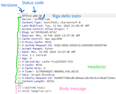

# Chapter 0.5
## Internet
In the World Wide Web, each resource is uniquely identified by a [URL](https://en.wikipedia.org/wiki/Uniform_Resource_Locator) (Uniform Resource Locator).

By resource, we mean any set of data or information that makes sense. Images, text paragraphs, videos, audios, web pages, program processing results are all examples of resources. Wikipedia defines "Web resources" as "all sources of information and services available on the Internet, identified by URL and physically present and accessible on web servers through the web browser of the client host."

If this definition is not clear, it will be useful to review the [client-server model](https://en.wikipedia.org/wiki/Client%E2%80%93server_model).

Formal illustration:

Practical example:

*Note: the default port - therefore the valid value if not specified - is 80, the fragment is by default the beginning of the page. The query strings, or parameters, are generally optional. Userinfo, i.e., username and password, not shown in the example, are typical of protocols other than those commonly seen in the browser, such as [FTP](https://en.wikipedia.org/wiki/File_Transfer_Protocol).*

### [URL-encoding](https://developer.mozilla.org/en-US/docs/Glossary/Percent-encoding)
To avoid reserved characters in the URL that could lead to unintended interpretation by the browser, URL encoding is used, officially called percent-encoding. If used for an attack, it is therefore useful to remember to encode URLs so that no part of the prepared "attack vector"/payload is lost.

Before URL-encoding:

After URL-encoding (what the server receives):

Note how only the text that can be directly controlled by the user is URL-encoded.

What is done is a conversion from the reserved character to its hexadecimal ASCII representation preceded by a %.

### [HTTP](https://en.wikipedia.org/wiki/Hypertext_Transfer_Protocol)
The Hypertext Transfer Protocol, HTTP, is a stateless protocol, meaning that each request is independent of previous requests. The two phases provided are the HTTP request (the client makes a request to the server) and the HTTP response (the server responds).

In general, every time the client needs to request a resource from the server, it communicates using HTTP.
This means that for every resource you want to view, your device must make an HTTP request and receive an HTTP response from the server.

Example of an HTTP request:

Example of an HTTP response:

If there is a need for information exchange outside the context of headers and queries, these can be included in the body of the message. In the shown request example, they would appear "underneath" the headers. The structure of the body message varies depending on the technology used by the specific site and is easily identifiable during practical experience.

#### [Common HTTP Methods](https://developer.mozilla.org/en-US/docs/Web/HTTP/Methods):
- **GET** (retrieve the resource or information about it)
- **POST** (action/send data to the resource)
- **HEAD** (GET without a body message)
- **TRACE** (diagnostic)
- **OPTIONS** (view available methods)
- **PUT** (create a new resource)
- **DELETE** (delete specified resource)
- **CONNECT** (establish a [tunnel](https://en.wikipedia.org/wiki/Tunneling_protocol) in case of a [proxy](https://en.wikipedia.org/wiki/Proxy_server))
- **PATCH** (modify the resource)

#### [Common HTTP Headers](https://blog.postman.com/what-are-http-headers/):
##### Request
- **Accept**: Defines the [MIME types](https://developer.mozilla.org/en-US/docs/Web/HTTP/Basics_of_HTTP/MIME_types) that the client will accept from the server, in order of preference. For example, `Accept: application/json, text/html` indicates that the client prefers to receive responses in [JSON](https://en.wikipedia.org/wiki/JSON) but also accepts them in [HTML](https://en.wikipedia.org/wiki/HTML).
- **User-Agent**: Identifies the browser and/or client making the request.
- **Authorization**: Used for sending credentials, useful when trying to access a protected resource.
- **Cookie**: Used to send previously stored cookies to the server. Useful for personalizing the user experience and "combating" the limitations of the stateless nature of the HTTP protocol.
- **Content-Type**: Defines the MIME type of the request body content.

##### Response
- **Content-Type**: As above.
- **Server**: The counterpart of `User-Agent`.
- **Set-Cookie**: Informs the client that it should store a cookie with a certain name, value, and optionally expiration, domain, path, and security flag. Example: `Set-Cookie: score=127`. Once `Set-Cookie` is received and accepted, the client will send the cookie to the server with every request made.
- **Content-Length**: Specifies the size in bytes of the response body. If it "appears" from the requester's side, we must be careful to specify the correct length if we want to modify our payloads.

In the examples shown above, you can see how these headers are used in real communication between a web browser and a static website.

Generally, when a header begins with `X-`, it is custom.
It is useful to note that the operation of HTTP is just a convention, and the server can decide to implement any method and any header (custom headers and methods). These elements are of interest to us, as they are implemented directly by the site manager and therefore more easily subject to implementation errors. Furthermore, nothing prevents the programmer from using a GET to modify data or a POST to provide information, although this is obviously not recommended. The same goes for the elements shown later in this chapter.

#### [Status Codes](https://developer.mozilla.org/en-US/docs/Web/HTTP/Status):
- **1xx**: Informational responses
- **2xx**: Success
- **3xx**: Redirection
- **4xx**: Client error (typically bad requests)
- **5xx**: Server error (program errors and unhandled exceptions)

#### *Summarizing*:

We can think of the HTTP request as a letter we send via mail. In the request line, we as senders specify what we want to be done and where we want it to be done, like writing the address and type of service desired on an envelope. The request headers contain information about us and our preferences, similar to writing our name and address on the back of the envelope. If the service provider needs material or an object to fulfill our request, we can include it in the body message, just like sending a package along with the envelope.

The server, similar to the recipient of our letter, receives the request, tries to fulfill it, and sends us a response letter. In the response status line, we understand whether everything went well or if there was a problem, just like reading the delivery indication on our postal envelope. In the response headers, we get information about who did the job and how they would like us to behave with the result. Finally, in the response body message, we receive the requested product, as if a package containing what we asked for were sent along with the envelope.

### [HTTP Cookies](https://developer.mozilla.org/en-US/docs/Web/HTTP/Cookies)
Cookies are often enriched with attributes, and the main ones are:
- **Expires**: Specifies the expiration time in seconds for the cookie. If not specified, the cookie is deleted at the end of the session (session cookie).
- **Secure**: Cookies with this flag are only sent in [HTTPS](https://en.wikipedia.org/wiki/HTTPS) requests (encrypted HTTP).
- **HttpOnly**: JavaScript cannot access the cookie.
- **Domain**: Defines the domain for which the cookie is valid.
- **Path**: Same as above but with the path.
- **Same-Site**: Specifies if the cookie can be included in requests involving third-party sites. `SameSite=Strict` indicates that the browser will refuse to share the cookie with websites other than the one that "told" us to set the cookie. It is a protection that can discourage CSRF attacks.

A cookie (in the browser: F12 -> Application -> Cookies):

### [HTTP Authentication](https://developer.mozilla.org/en-US/docs/Web/HTTP/Authentication)
According to the HTTP protocol standards, the structure of communication between a client requesting a protected resource and the server consists of the following steps:
- The client requests the resource.
- The server responds with the status code `401 Unauthorized`, specifying through the `WWW-Authenticate` header the type of authentication required. At this stage, various information can be sent to the client, depending on the authentication method required.
- The client must respond with the `Authorization` header containing the requested credentials.
- The server responds with `200 OK` or `403 Forbidden` (access denied).

`401 Unauthorized` = "I don't know who you are", `403 Forbidden` = "You are not a user who has access to the resource".

#### Main authentication types:
- **Basic Authentication**: `username:password` are sent encoded in [`base64`](https://en.wikipedia.org/wiki/Base64). The encoding provides no additional security layer, so `Basic` authentication over HTTP is completely insecure, like sending information in plaintext.
- **Digest Authentication**: Obscures username and password using other parameters like `realm` and `nonce`.
- **Bearer Authentication**: Mainly used in contexts based on [OAuth2](https://www.ory.sh/oauth2-for-everyone). In essence, instead of providing credentials to the server requesting authentication, we authenticate ourselves to another server that the initial server trusts. This is possible because the authenticating server provides the user with a token to use as a "pass" when we move to the final stage of the authentication process. Tokens are often generated as [JWT](https://en.wikipedia.org/wiki/JSON_Web_Token).

*Note: Authentication types may not be immediately clear, and they may not necessarily be exploitable in attacks useful to the CyberChallenge context, but the use of Bearer authentication is on the rise and is an especially important topic. I strongly recommend further independent study.*

### Chapter Conclusion:
When defending or attacking a service, it is useful to remember that cookies, headers, body content, and the request method can be modified by the client as it wishes. There are tools (like BurpSuite) that allow easy modification of all possible information that the server is able to receive. Trusting what is sent by the client means accepting to manage a vulnerable service. A developer must ensure to limit as much as possible the functionalities that require user trust. The stateless nature of HTTP forces developers to use cookies for authentication (imagine having to log in every time you change a reel), putting them in difficulty and opening up the possibility for various types of cross-site attacks that we will see later.

*Challenge: First 6 web security challenges starting from [this](https://training.olicyber.it/challenges#challenge-41)*

\newpage