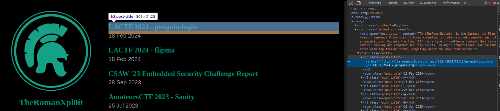

# Chapter 1
## [Python requests](https://realpython.com/python-requests/)

## Installation
```bash
pip install requests
from requests import *
pip install beautifulsoup4
from bs4 import BeautifulSoup
```

## Methods
In the requests library, each HTTP method corresponds to a function.

Calling the function of an HTTP method, for example `get`:
```python
response = get('https://api.github.com')
```
returns a `Response` object that contains a lot of information about the response we received, including:
- ## Status code: `response.status_code`
Note that `response.status_code` is an integer, while `response` is `True` if the status code is between 200 and 400, `False` otherwise. (If you want to understand how this is possible, you can take a look at [method overloading](https://realpython.com/operator-function-overloading/#making-your-objects-truthy-or-falsey-using-bool))
- ## Content: `response.text`
This allows us to see what was returned by the server, what we would have seen if we had visited the same link from a browser. `response.content` does the same thing but returns bytes instead of a string.
- ## JSON Content: `response.json()`
Particularly useful when dealing with [APIs](https://www.azionadigitale.com/api-cosa-sono-e-come-funzionano/). We would get the same result by using `.text` and deserializing the result with `json.loads(response)`
- ## Headers: `response.headers`
Which returns an object similar to a dictionary but with case-insensitive keys. So if we want to access a particular header, we can specify it: `response.headers['content-type']`

## Request Customization
As seen in the previous chapter, there are different types of information exchange that allow customization of a request:

- ### Query string parameters
```python
response = get(
    'https://it.wikipedia.org/w/index.php',
    params={'search': 'capture+the+flag'},
)
```

- ### Headers
```python
response = get(
    'https://it.wikipedia.org/w/index.php',
    params={'search': 'capture+the+flag'},
    headers={'User-Agent': 'Mozilla/5.0'},
)
```

## Other Methods
```python
post('https://httpbin.org/post', data={'key':'value'})
put('https://httpbin.org/put', data={'key':'value'})
delete('https://httpbin.org/delete')
head('https://httpbin.org/get')
patch('https://httpbin.org/patch', data={'key':'value'})
options('https://httpbin.org/get')
```

## Sessions
If it is necessary to perform multiple actions through a single connection (e.g., passing through multiple APIs that assign and check cookies/headers), you can use the [`Session`](https://requests.readthedocs.io/projects/it/it/latest/user/advanced.html#oggetti-session) object.

```python
s = Session()

s.get('http://httpbin.org/cookies/set/sessioncookie/123456789')
r = s.get("http://httpbin.org/cookies")

print(r.text)
# '{"cookies": {"sessioncookie": "123456789"}}'
```

Among the many possible use cases, sessions can be particularly useful in attacks and defenses that propose services where you need to register/login to obtain the flag. In these cases, it may be convenient to use sessions leveraging [`context managers`](https://realpython.com/python-with-statement/):

```python
with requests.Session() as session:
    session.auth = ('randomuser', 'randompass')

    session.post('https://api.cyberchallenge.it/pwnedwebsite/register')
    session.post('https://api.cyberchallenge.it/pwnedwebsite/login')
    response = session.get('https://api.cyberchallenge.it/pwnedwebsite/idor/flag')
```

## Cookies
As mentioned, if cookies are involved in the process to be automated, it is advisable to use sessions so as not to have to do any manual intervention.

If we want to view or add cookies, just know that they are saved in a dictionary, so to get them just use `session.cookies.get_dict()`

For a "clean" visualization of the various cookie parameters (thanks [Bobby](https://bobbyhadz.com/blog/how-to-use-cookies-in-python-requests)):

```python
import requests

response = requests.get('http://google.com', timeout=30)

# {'AEC': 'Ad49MVE4KO7sQX_pRIifPtDvL666jJcj34BmOFeETG9YU_1mu1SINQN-Q_A'}
print(response.cookies.get_dict())

result = [
    {'name': c.name, 'value': c.value, 'domain': c.domain, 'path': c.path}
    for c in response.cookies
]

# [{'name': 'AEC', 'value': 'Ad49MVGjcnQKK55wgCKVdZpw4PDgEgicIVB278lObJdf4eXaYChtDZcGLA', 'domain': '.google.com', 'path': '/'}]
print(result)
```

##### Adding a Cookie to the Session
The requests library uses CookieJar to manage cookies. To add a cookie to the session's CookieJar, you can use the `update` method:
```python
from requests import *
s = Session()
s.cookies.update({'username': 'Francesco Titto'})
response = s.get('http://ctf.cyberbootcamp.it:5077/')
```

In particular, the `session.cookie.XYZ` methods help interface with the CookieJar. There are many useful methods, but what has been covered so far is sufficient for the purpose of this guide.

#### Tips&Tricks
##### Checking "Allowed" Methods
As seen in the previous chapter, the `OPTIONS` method allows you to view the available methods. To do this, after executing an `OPTIONS` request, the desired result will be returned in the `Allow` header: `response.headers['allow']`

##### Using the Right Parameters
We have seen the different ways to send data to the server. It is important not to confuse `params`, which sends query parameters, `data`, which sends information in the request body, and `json` which does the same thing by converting the dictionary we give it into JSON and setting the `Content-Type` header to `application/json`. Note that inserting JSON into the `json` parameter, for example: `json=json.dumps(data)` will result in double dumping (and therefore various errors that are difficult to understand).

##### `robots.txt` and `sitemap.xml`
In some blackbox challenges of CyberChallenge (but especially OliCyber), it may happen that some necessary information for solving the challenge (including source code) is indicated in the `robots.txt` or `sitemap`. Checking costs you nothing and can save you a lot of time. It is much rarer in other CTFs (I have never found anything in it).

##### Timeout
To prevent the program from freezing due to a wrong request or an infrastructure problem, the `Timeout` was introduced: `get('https://api.github.com', timeout=1.5)`. You can insert the number of seconds (int or float) to wait before an error is triggered. When combined with `Try/Except`, it can be useful for time-based attacks (encryption, SQL, and more).

## [DOM](https://en.wikipedia.org/wiki/Document_Object_Model)
Pressing F12 in major browsers opens the developer tools. The first section shown by default is `elements`, which allows us to interactively explore the Document Object Model (DOM).

The DOM is a multi-platform and language-independent structure, but in our case, the following definition is sufficient: the DOM is an interface that treats HTML as a tree structure where each node is an object representing part of the document.

If you have never dealt with HTML and/or the concept of DOM, the best way to understand how it works and get comfortable with it is to visit sites you know well (for example, an article on [Wikipedia](https://en.wikipedia.org/wiki/Capture_the_flag_(computer_security))) and use the `elements` section of the developer tools.



Hovering over one of the elements will highlight it.

In the example shown, `h3` is the [tag](https://developer.mozilla.org/en-US/docs/Glossary/Tag) of the [element](https://developer.mozilla.org/en-US/docs/Glossary/Element), `post-title` is the class. There may also be an `id`, which uniquely identifies the element.

### [BeautifulSoup](https://realpython.com/beautiful-soup-web-scraper-python/)
BeautifulSoup is an extremely useful library for [web scraping](https://en.wikipedia.org/wiki/Web_scraping). It is used together with the `requests` library to automatically obtain a series of data of interest.

#### Creating a BeautifulSoup object and printing it
```python
import requests
from bs4 import BeautifulSoup

URL = "https://theromanxpl0.it/"
page = requests.get(URL)

soup = BeautifulSoup(page.content, "html.parser")

print(soup.prettify())
```

#### Finding an element by ID
```python
results = soup.find(id="penguin-login writeup")
```

#### Finding elements by tag and/or class/text
```python
results = soup.find_all("h3", class_="post-title")
resText = soup.find_all("h3", string="penguin")

for result in results:
    print(result.prettify(), end="\n")

for result in resText:
    print(result.prettify(), end="\n")
```

#### Extracting text from an element
```python
print(result.text, end="\n")
```

For the structure of the DOM, it has a hierarchy, meaning the contents are nested within each other (what we see are all children of the element with the `HTML` tag).

#### Accessing the parent of an element
```python
result = soup.find("h3", class_="post-title")
result = result.parent
print(result.text, end="\n")
```

#### Extracting links
The `a` elements roughly represent a link, which is found as an `href` attribute.

```python
import requests
from bs4 import BeautifulSoup

URL = "https://theromanxpl0.it/"
page = requests.get(URL)

soup = BeautifulSoup(page.content, "html.parser")

links = soup.find_all("a")
for link in links:
    link_url = link["href"]
    print(f"writeup link: {link_url}\n")
```

*Exercises: First 16 starting from this one: https://ctf.cyberchallenge.it/challenges#challenge-255*
*In case you don't have access to the CyberChallenge platform, there is a public alternative here: https://training.olicyber.it/challenges#challenge-340*

*The introduction is very concise and more oriented towards examples as the topic can become very large depending on how much you want to delve into it, and I don't expect you to use this library very often, even less so if it's not a superficial use.*

\newpage
