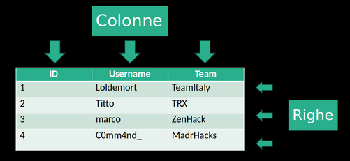
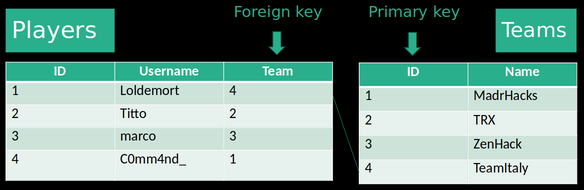

# Chapter 1.5
## [Relational Databases](https://www.oracle.com/database/what-is-a-relational-database/) and [SQL](https://en.wikipedia.org/wiki/Structured_Query_Language)

Relational Database Management Systems (DBMS) and Structured Query Language are vast topics that are the subject of entire exams. However, for what we need, we can achieve satisfactory results by simply getting familiar with a few concepts and instructions.

### Relational Model
In the relational model, information is structured into tables, rows, and columns.

A relational database is structured very similarly to a spreadsheet (e.g., Excel). Each spreadsheet is a table where information is stored. The columns represent various attributes, and the rows represent "records," entities, in a sense they are the subjects of the collected data.

Example of a table:



So, the records in a table share the same "structure": for each of them, we have the same type of information.

For each table, a *primary key* is defined, which is a piece of data that uniquely identifies each row or record.
The primary key can be defined by multiple columns or by useful information about the record, but for simplicity, it tends to be defined on a single column, often created for this sole purpose, called ID (or similar). For simplicity, you can remember the primary key as a unique identifier. However, it is useful to remember that the primary key can be multi-column or (more likely) that it is a piece of data such as a tax code or registration number.

Furthermore, each row can be used to create a relationship between different tables using a *foreign key*, which is the primary key of another table.

Summary example:



### DBMS
A generic database is a collection of data managed and organized by the DBMS (Database Management System). RDBMS manages relational databases.

The user has in mind a logical schema of how a database should be (look at the examples above), but the records must be physically stored somehow as bits. The DBMS takes care of managing the data itself, controlling concurrent access, ensuring data security and integrity, and allowing data migration, all the while allowing the user to access the data through a conceptual schema rather than the data physically present in memory.

tldr: It allows abstraction while ensuring fast access to data and their integrity.

### SQL
SQL is the standard language for manipulating databases.

Let's go through some examples. First of all, let's see all the data we will work with in this tutorial:

#### SELECT/FROM

`SELECT * FROM players;`

| ID | Username | Team |
| ----------- | ----------- | ----------- |
| 1 | Loldemort | 4 |
| 2 | Titto | 2 |
| 3 | marco | 3 |
| 4 | C0mm4nd_ | 1 |

`SELECT * FROM Teams;`

| ID | Name |
| ----------- | ----------- |
| 1 | MadrHacks |
| 2 | TRX |
| 3 | ZenHack |
| 4 | TeamItaly |

Let's see the teams. The ID doesn't tell us much... Let's only take the names:

`SELECT Name FROM Teams;`

| Name |
| ----------- |
| MadrHacks |
| TRX |
| ZenHack |
| TeamItaly |

And what if we wanted to see only the name of the second team entered in the database?

#### WHERE

`SELECT Name FROM Teams WHERE ID = 2;`

| Name |
| ----------- |
| TRX |

So, the structure of the `SELECT` is: `SELECT [column/s] FROM [table] WHERE [condition]`, and it is not necessary to select a column to use it as a condition, as we saw in this last example.

Now let's select all the teams except the first two:

`SELECT * FROM Teams WHERE ID > 2;`
`SELECT * FROM Teams WHERE ID >= 3;`

| ID | Name |
| ----------- | ----------- |
| 3 | ZenHack |
| 4 | TeamItaly |

But let's order them alphabetically:

`SELECT * FROM Teams WHERE ID >= 3 ORDER BY Name;`

| ID | Name |
| ----------- | ----------- |
| 4 | TeamItaly |
| 3 | ZenHack |

But the ranking was nicer before...

#### ORDER BY

`SELECT * FROM Teams WHERE ID >= 3 ORDER BY Name DESC;`

| ID | Name |
| ----------- | ----------- |
| 3 | ZenHack |
| 4 | TeamItaly |

Full syntax: 
```sql
SELECT column[s]
FROM table[s]
WHERE condition[s]
ORDER BY column[s] [asc/desc];
```

#### Multiple conditions

If we insert multiple columns in the ORDER BY, the order in which we list them will matter. For example, if we wanted to select players based on their score and in case of a tie give priority to the younger one, we could use this query: `SELECT name, score FROM players ORDER BY score DESC, age ASC;`. Multiple conditions can be included in a `WHERE` using the `OR` and `AND` operators.

### SQL for Exploitation
There are other statements and operators that are particularly useful when performing SQL injection, a type of attack that we will delve into in detail in the next chapter.

#### LIKE and Wildcards

`LIKE` allows us to search for a string that "resembles" the one provided. This is possible thanks to *wildcards*. The two most important wildcards for our purposes are the underscore `_`, which represents a single character, and the percent `%`, which represents none or more characters. Some examples on the `Players` table:

`SELECT * FROM Players WHERE Username LIKE "_arco"`

| ID | Username | Team |
| ----------- | ----------- | ----------- |
| 3 | marco | 3 |

`SELECT * FROM Players WHERE Username LIKE "%o"`

| ID | Username | Team |
| ----------- | ----------- | ----------- |
| 2 | Titto | 2 |
| 3 | marco | 3 |

`SELECT * FROM Players WHERE Username LIKE "%o%"`

| ID | Username | Team |
| ----------- | ----------- | ----------- |
| 1 | Loldemort | 4 |
| 2 | Titto | 2 |
| 3 | marco | 3 |

`SELECT * FROM Players WHERE Username LIKE "%Titto"`

| ID | Username | Team |
| ----------- | ----------- | ----------- |
| 2 | Titto | 2 |

#### UNION SELECT

Do you remember about `foreign key` and `primary key`?


`JOIN` is a statement that allows us to perform useful manipulations using these two pieces of information. For now, we are only interested in obtaining information from two different tables, regardless of whether there is a relationship between them, and the `UNION` helps us with that. To use it, simply write two `SELECT` statements related to two different tables, and put a `UNION` in between:

`SELECT Username FROM Players WHERE Username LIKE "L%" UNION SELECT Name FROM Teams WHERE ID = 2`

| Username |
| ----------- |
| Loldemort |
| TRX |

When executing a `UNION SELECT`, we need to keep in mind that:
- Each select statement must have the same number of columns. `SELECT ID, Username FROM Players UNION SELECT Name FROM Teams` is not valid.
- The columns must involve "similar" data types. For example, strings and varchar, although not the same type, can be part of the same column IN A UNION QUERY! `SELECT ID FROM Players UNION SELECT Name FROM Teams` returns an error.
- The columns generated by a `UNION SELECT` will have the same name as the columns selected from the first named table. This is not a problem in itself, but it can be confusing when the query results are returned (in the previous example, TRX appears in the Username column).

As future xHackerZx, we cannot be discouraged by the first difficulties. There are shortcuts we can use, forcing special features provided by SQL queries.

#### Mock Columns
**"Each `SELECT` must have the same number of columns"**
If the application we are interacting with proposes a query with too many columns (we want to know only the team names through a union, but in the players table, the ID is also selected), we can use mock columns.

These consist of inserting fixed values instead of the column name so that a fake column is selected from the query:

`SELECT ID, Username FROM Players UNION SELECT 1337, Name FROM Teams`

| ID | Username |
| ----------- | ----------- |
| 1 | Loldemort |
| 2 | Titto |
| 1337 | TeamItaly |
| 1337 | TRX |

etc...

We can also use `"character"` if we want to create a fake `varchar` column.

#### Concatenation

If we have too few columns available, we can exploit concatenation:

`SELECT Name FROM Teams UNION SELECT CONCAT(Username," ",Fullname) FROM Players`

The concatenation method varies greatly between different DBMS, so it will be necessary to do a new search on concatenation whenever we encounter a new DBMS.

In our case, however, the Players table does not contain the `Fullname`, besides the username there are only ID and the player's team ID as a foreign key. We couldn't concatenate this information with `Username`, since these others are integers and not varchar. In cases like these, the shortcut presented in the next paragraph is particularly useful

#### CASTing
**"The columns must involve similar data types"**
In this case, we can rely on CASTing, which allows us to transform data from one type to another when possible. For example, the query:

`SELECT Username FROM Players UNION SELECT CAST(ID as varchar) FROM Teams` is valid and returns

| Username |
| ----------- |
| Loldemort |
| Titto |
| "1" |
| "2" |

CASTing, like concatenation, can vary greatly between different DBMS. In general, this is true for almost all statements that go beyond satisfying the most basic needs of the programmer, such as simple `SELECT`. For this reason, it is more useful to learn to search for the necessary information on the internet than to memorize the syntax of the SQL standard.

#### AS
**"The columns generated by a `UNION SELECT` will have the same name as the columns selected from the first named table."**
As already mentioned, this is not a problem for us. If you want to solve it, just use the `AS` keyword on the first selected columns:

`SELECT Username FROM Players AS "UserAndTeamNames" UNION SELECT Name FROM Teams`

| UserAndTeamNames |
| ----------- |
| Loldemort |
| Titto |
| TRX |
| TeamItaly |

etc...

As with `SELECT`, if you need to rename multiple columns, just separate the various names with a comma.

*Practice: [SQLBolt](https://sqlbolt.com/)*

\newpage
